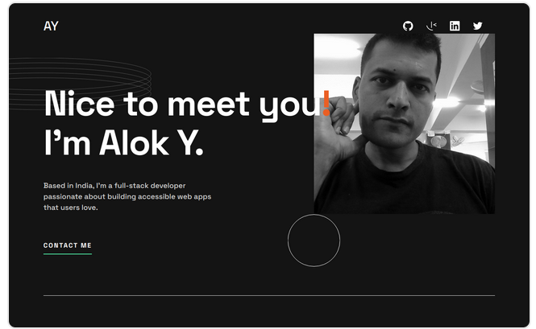
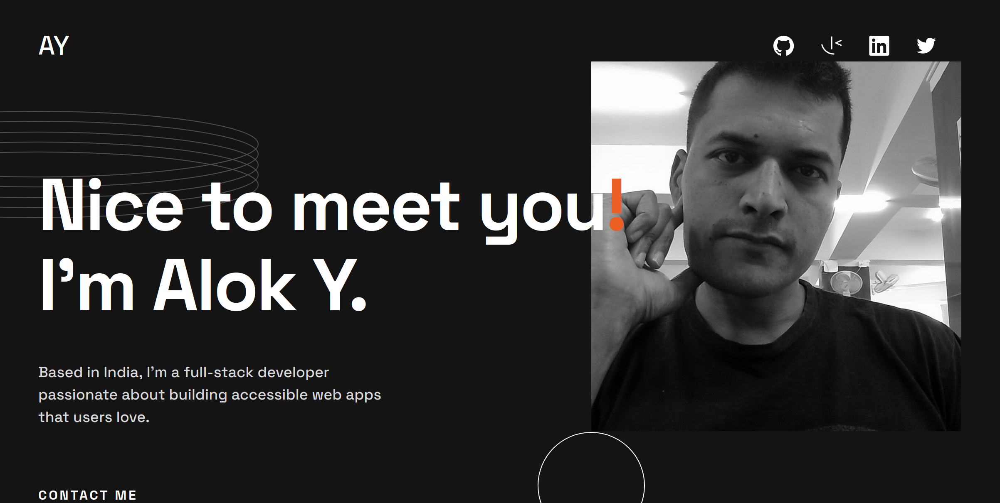

 

  

  <h3 align="center">Alokananda Y | Single page portfolio site</h3>

  

    An Awesome single page portfolio site to showcase my skills and projects!
     
     
    <a href="https://github.com/alok-38/portfolio-website"><strong>Explore the docs »</strong></a>
     
     
    <a href="https://portfolio-website-ov74uokh8-alok-38.vercel.app/">View Demo</a>
    .
    <a href="https://github.com/alok-38/portfolio-website/issues">Report Bug</a>
    .
    <a href="https://github.com/alok-38/portfolio-website/issues">Request Feature</a>
  

     

## Table Of Contents

- [About the Project](#about-the-project)
- [Built With](#built-with)
- [Getting Started](#getting-started)
- [Usage](#usage)
- [Contributing](#contributing)
- [License](#license)
- [Authors](#authors)
- [Acknowledgements](#acknowledgements)

## About The Project

I decided to keep a portfolio site ready with dummy projects as placeholders. I will start to
fill in the projects section with contents as soon as I have a couple of solid projects to showcase.

## Built With

This section should list any major frameworks that you built your project using. Leave any add-ons/plugins for the acknowledgements section. Here are a few examples.

## Getting Started

This is not bootstrapped with any JS frame work. This is a pure JS project.

## Usage

Use this space to show useful examples of how a project can be used. Additional screenshots, code examples and demos work well in this space. You may also link to more resources.

_For more examples, please refer to the [Documentation](https://example.com)_

## Contributing

Contributions are what make the open source community such an amazing place to be learn, inspire, and create. Any contributions you make are **greatly appreciated**.

- If you have suggestions for adding or removing projects, feel free to [open an issue](https://github.com/alok-38/ReadME-Generator/issues/new) to discuss it, or directly create a pull request after you edit the _README.md_ file with necessary changes.
- Please make sure you check your spelling and grammar.
- Create individual PR for each suggestion.
- Please also read through the [Code Of Conduct](https://github.com/alok-38/ReadME-Generator/blob/main/CODE_OF_CONDUCT.md) before posting your first idea as well.

### Creating A Pull Request

1. Fork the Project
2. Create your Feature Branch (`git checkout -b feature/AmazingFeature`)
3. Commit your Changes (`git commit -m 'Add some AmazingFeature'`)
4. Push to the Branch (`git push origin feature/AmazingFeature`)
5. Open a Pull Request

## License

Distributed under the MIT License. See [LICENSE](https://github.com/alok-38/ReadME-Generator/blob/main/LICENSE.md) for more information.

## Authors

- **Alokananda Y** - _Scrimba Boot-Camp Student_ - [Alokananda Y](https://github.com/alok-38) - _Built ReadME Template_

## Acknowledgements

- [Alokananda Y](https://twitter.com/plantsfortrees)
